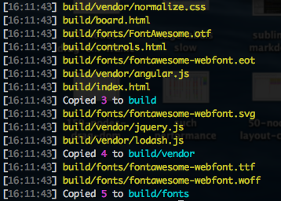

# gulp-count
> Count files in vinyl streams. Log pretty messages.



This plugin is very similar to [gulp-debug](https://github.com/sindresorhus/gulp-debug) but is designed as an actual permanent part of your workflow, not just a debug tool. As such, it provides more control over logging to customize as needed.

## Usage
First, install `gulp-count` as a development dependency:

```shell
> npm install --save-dev gulp-count
```

Then, add it to your `gulpfile.js`:

```javascript
var count = require('gulp-count');

gulp.task('copy', function() {
    gulp.src('assets/**.*')
        .pipe(gulp.dest('build'))
        .pipe(count('## assets copied'));
});
```


## API
gulp-count can be called with a string message template, an options object, or both.

```javascript
gulp.src('*.html')
    .pipe(count()) // logs "36 files"
    .pipe(count('<%= counter %> HTML files'))  // logs "36 HTML files"
    .pipe(count('found ## pages', {logFiles: true})) // logs each path and "found 36 pages"
    .pipe(count({
        message: '<%= files %>? That\'s ## too many!'
        logger: (msg) -> alert(msg) // alerts "36 files? That's 36 too many!"
    });
```

### count([message], options)

#### message, options.message
Type: `String`

Default: `'<%= files %>'`

Template string for total count message, passed through `gutil.template`.

Template receives two variables: `counter`, the number of files encountered in this stream, and
`files`, a correctly pluralized string of the format "X file[s]" where X is `counter`. The template
also expands the shorthand `"##"` to `"<%= counter %>"`.

The number of files (`counter` variable) is logged in magenta and file paths are logged in yellow.

#### options.title
Type: `String`

String prepended to every message to distinguish the output of multiple instances logging at once.
A falsy value will omit title from the message.

#### options.logFiles
Type: `Boolean`

Default: `false`

Whether to log each file path as it is encountered. `options.cwd` determines base path for logging.

#### options.cwd
Type: `String`

Default: `''`

Current working directory for logging file paths.

#### options.logger
Type: `Function`

Default: `gutil.log`

Logger function, called once at the end with formatted `message` and once per file with filepath if `logFiles` is enabled.

## License
MIT &copy; [Palantir Technologies](http://palantir.com)
